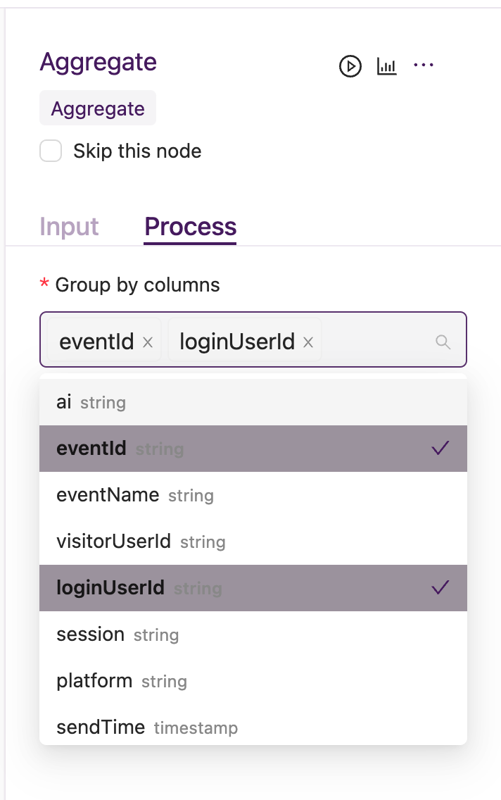
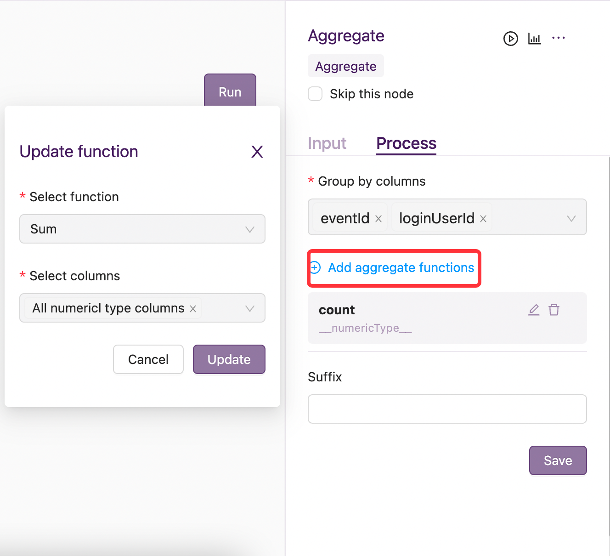

Aggregation
===========

1. 场景：用于对数据集做聚合。支持多个分组字段，支持对数值类型、字符类型和日期类型的列进行聚合，同时支持按字段类型进行聚合。
2. 输入：需要指定group by columns，添加aggregate function 且聚合后字段名后缀可选

3. 案例说明,输入数据如下：

=========================================  ======================  ===========
      user_id                                    date                click_nu
=========================================  ======================  ===========
1234                                        2021-01-01              2
1234                                        2021-01-02              3
1234                                        2021-01-02              2
5678                                        2021-01-02              5
5678                                        2021-01-02              6
=========================================  ======================  ===========

以上输入数据，若指定group by columns 是 ``user_id`` 、``date`` ，aggregate function是 ``Sum`` ，columns是 ``click_nu``，则经过aggregation节点处理后，输出如下：

====================================  ======================  ===========
      user_id                                    date              click_nu_sum
====================================  ======================  ===========
1234                                        2021-01-01              2
1234                                        2021-01-02              5
5678                                        2021-01-02              11
====================================  ======================  ===========
